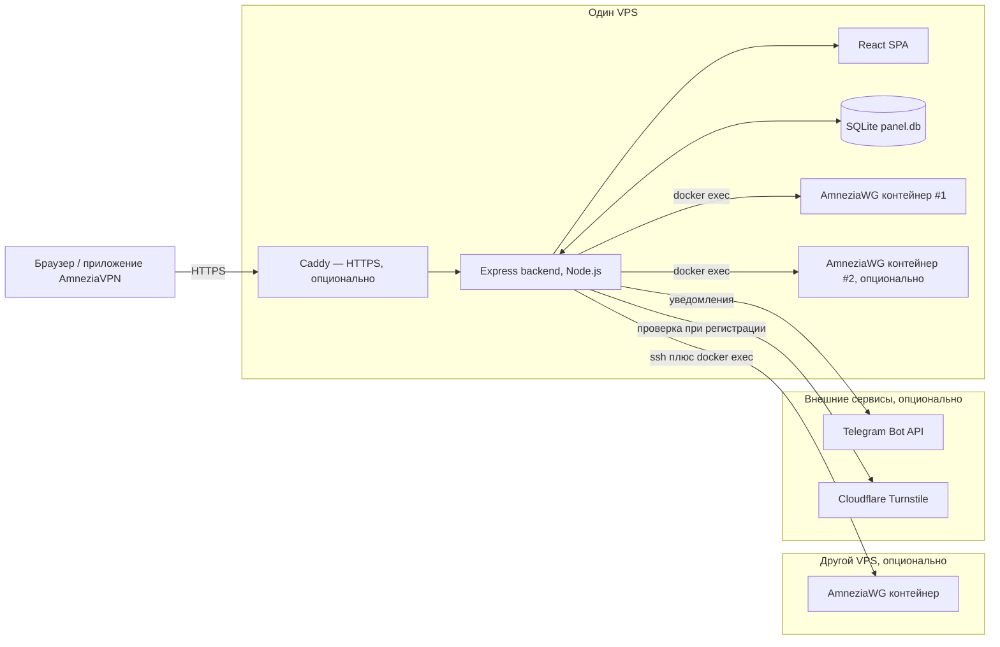
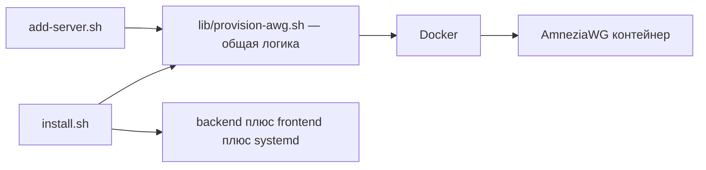
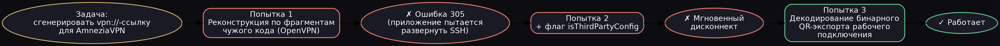
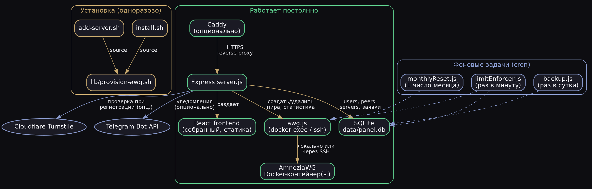

# Skdsh Panel

Полностью автономная self-hosted панель управления AmneziaWG-сервером —
альтернатива Marzban/3X-UI, но заточенная конкретно под протокол AmneziaWG
и приложение AmneziaVPN. Один VPS, ноль внешних сервисов.

Разворачивает VPN-сервер **без установки приложения Amnezia** и без SSH-доступа
со стороны клиентского приложения — всё делает один install-скрипт.


---

## Архитектура



**Установка — что от чего зависит:**



---

## Возможности

**Админ:**
- Список всех пользователей с живой статистикой трафика
- Создание доступа в один клик — ключи генерируются на сервере
- Лимиты трафика с автоматической ежемесячной обнулением (проверка раз
  в минуту — блокировка не мгновенная, на быстром интернете возможен
  небольшой перебор сверх лимита между проверками)
- Блокировка/удаление, переименование устройств
- Раздел заявок на подключение — одобрить/отклонить без единого SQL-запроса
- Сброс пароля любому пользователю без необходимости знать старый
- Ежедневное автоматическое резервное копирование базы
- Уведомления в Telegram о новых заявках и обращениях (опционально)
- Управление несколькими AmneziaWG-серверами из одной панели

**Клиент:**
- Логин/пароль (без email — саморегистрация тоже поддерживается)
- Датчик расхода трафика в реальном времени
- Несколько устройств под одним логином
- QR-код и файл конфига — **в двух форматах**: обычный WireGuard и
  нативная `vpn://`-ссылка для AmneziaVPN с человеческим именем сервера
- Запрос доп. устройства, обращения в поддержку — прямо в кабинете

**Инфраструктура:**
- SQLite вместо внешней БД — весь проект на одном VPS
- Своя авторизация (bcrypt + JWT), без сторонних auth-провайдеров
- Install-скрипт: Docker → AmneziaWG-контейнер → NAT/forwarding → backend →
  фронтенд → systemd → опционально Caddy с авто-HTTPS — всё одной командой
- Защита от подбора пароля, резервные копии, ежемесячный сброс лимитов

---

## Как это всё началось

Проект вырос из личной задачи: разобраться, почему у меня отвалился VPN,
поднятый через приложение AmneziaVPN на арендованном сервере. По ходу
разбирательств стало понятно, что для нескольких человек в семье удобнее
не гонять всех через одно приложение-администратор, а сделать нормальную
веб-панель — как Marzban, только под протокол AmneziaWG, который Marzban
не поддерживает.

## Генерация `vpn://`-ссылок для AmneziaWG

Приложение AmneziaVPN использует закрытый, нигде официально не
задокументированный формат ссылок для быстрого добавления сервера.
Панели нужно было научиться создавать такие ссылки самой — под каждого
нового пользователя, с его собственными ключами.



Реализация — в [`src/awg.js`](src/awg.js), функция `buildAmneziaVpnLink`.

**Важно:** этот проект не аффилирован с командой Amnezia и не использует
их код напрямую — только независимая реализация формата.

---

## Архитектура



---

## Установка на новый сервер

```bash
scp -r skdsh-panel root@ВАШ_IP:/opt/skdsh-panel
ssh root@ВАШ_IP
cd /opt/skdsh-panel
chmod +x install.sh
sudo ./install.sh
```

Скрипт спросит:
- Публичный IP сервера
- Порт WireGuard (по умолчанию 39001)
- Порт веб-панели (по умолчанию 3001)
- Домен для HTTPS (необязательно — без него доступ через SSH-туннель)
- Название сервера, которое увидят клиенты в приложении
- Логин/пароль администратора

И сам поставит Docker, Node.js, развернёт AmneziaWG (образ
`vernette/amneziawg`), настроит NAT/форвардинг трафика, соберёт фронтенд,
запустит всё как systemd-сервис, и при указанном домене — настроит Caddy
с автоматическим HTTPS через Let's Encrypt.

### Без домена — доступ через SSH-туннель

```bash
ssh -L 3001:localhost:3001 root@ВАШ_IP
```

Затем откройте `http://localhost:3001` в браузере.

---

## Стек

**Backend:** Node.js, Express, better-sqlite3, bcryptjs, jsonwebtoken, node-cron
**Frontend:** React 18, Vite, Framer Motion
**Инфраструктура:** Docker, AmneziaWG, Caddy

## Несколько AmneziaWG-серверов

Панель умеет управлять несколькими AmneziaWG-серверами одновременно —
раздел "Серверы" в админке (добавление, редактирование, привязка пиров
к конкретному серверу). Два режима:

- **На этой же машине** — панель обращается к контейнеру через `docker
  exec` напрямую. На одном хосте можно поднять несколько независимых
  AmneziaWG-инстансов (разные порты, разные подсети, уникальные имена
  сетевых интерфейсов — иначе конфликт на уровне `--network host`)
- **Удалённый по SSH** — панель заходит на другой VPS по SSH и там уже
  выполняет `docker exec`. Требует SSH-ключ без пароля и root-доступ
  (или права на docker) на удалённой машине

Оба сценария разворачиваются одним скриптом —
[`add-server.sh`](add-server.sh) — он сам спрашивает, разворачивать
здесь или на другом сервере по SSH, и умеет **сразу зарегистрировать**
сервер в панели через API (спросит адрес панели и логин/пароль
администратора) — без ручного переноса значений в форму, хотя такой
вариант тоже доступен как запасной.

`install.sh` при первой установке тоже предложит развернуть
дополнительные серверы сразу же, в конце процесса — не обязательно
запускать `add-server.sh` отдельным шагом сразу после установки, хотя
он всегда доступен и для более поздних добавлений. Оба скрипта
используют общую логику разворачивания из [`lib/provision-awg.sh`](lib/provision-awg.sh),
чтобы не держать два места с одним и тем же кодом.

## Что не реализовано (сознательно, для первой версии)

- Email-уведомления — вместо этого Telegram-бот (см. `TELEGRAM_BOT_TOKEN`
  в `.env.example`); можно добавить и SMTP отдельным шагом, если нужно
- SSH-путь для удалённых серверов проверен только логически (генерация
  и синтаксис команд), без реального второго VPS под рукой — при первом
  использовании стоит протестировать на некритичном сервере

## Лицензия

MIT
